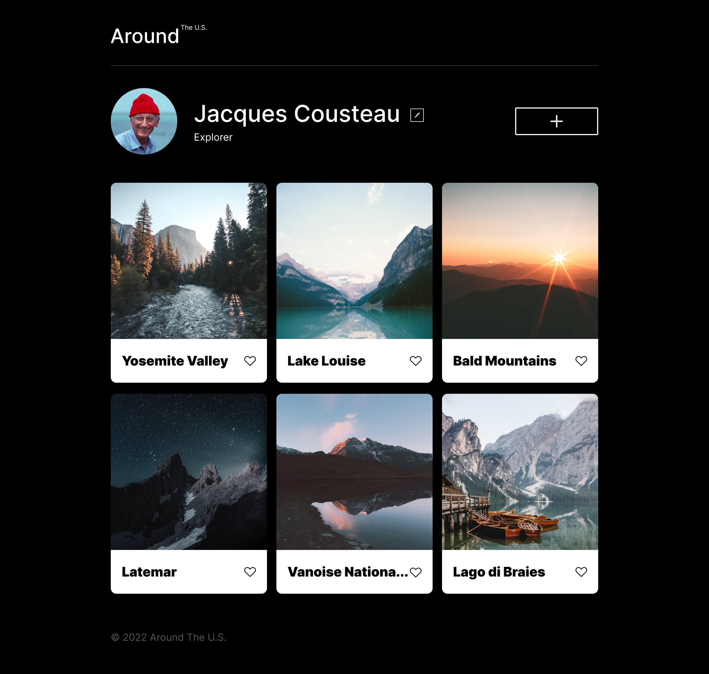

# Project 3: Around The U.S.

### Overview

- Intro
- Figma
- Images
- Grid layouts
- Media query's
- Responsive design
- 6 cards
- **Intro**

This project is a responive design from a regular computer, tablet and finally a mobile screen resolution. To achieve this I had to use media query's at resolutions of 110px, 760px, and 480px. I also used woff2 fonts that I had to download into the fonts block. The fonts were than implented into the project by using the @font-face element in the fonts.css tab and then they were imported using the @import in the index.css.

- [Video link describing the project](https://drive.google.com/file/d/1LXmyzTCMWHCIrkt8mBzHUciMGFuKKnGH/view?usp=drive_link)

**Figma**

- [Link to the project on Figma](https://www.figma.com/file/ii4xxsJ0ghevUOcssTlHZv/Sprint-3%3A-Around-the-US?node-id=0%3A1)

**Images**

